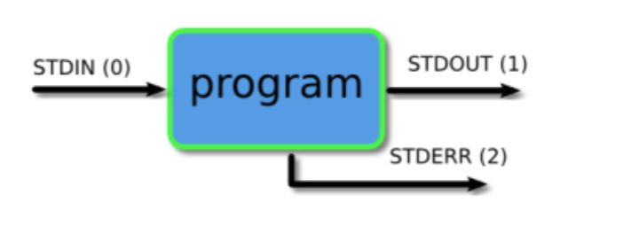

# BASH COMMANDS
- Useful link for bash commands https://explainshell.com

## Head, Tail, Sort
- Displays the first X lines of a file
- Syntax is `head <options> <file>`
#### Head
- One option is `head -n<number> <file>` which will get the first <number> of lines

#### Tail
- Tail displays the last X lines of a file
- syntax is `tail <options> <file>`
- One option is `tail -n<number> <file>` which will get the last <number> of lines
- Default for both is 10 lines

#### Sort
- Sort is used to alphabetically or numerically sort the content by each line
- Syntax is ` sort <filename>`
- add command after sort depending what you want to sort by
  - `-r` reverse order
  - `-n` numerical
  - `-nr` numerically reversed
  - `-k <num>n` sort by collumn <num>
  - `-c` check if a file is sorted, if sorted then no output
  - and more

### Demo

## Permissions
- To change file permissions use `chmod` command followed by the permission level and file we would like to edit.
- syntax is `chmod <value> <file>`

| Value   | Meaning    | 
| :-------- | ------: | 
| 777 | No restrictions | 
| 755 | The files owner may read, write and execute. Others may read and execute | 
| 700 | The files owner may read, write and execute. Nobody else has rights | 
| 666 | All users may read and write the file | 
| 644 | The files owner may read and write. Others may only read | 
| 600 | The files owner may read and write. Nobody else has rights |
- In summary this table uses binary values
- User, group,and other
- read - 4
- write - 2
- execute - 1

- YOu can also change permissions using flag names
- e.g `chmod +x <file>`
- falgs:
  - +x makes file executable
  - +r gives read rights
  - +w gives write rights

## Streams and Redirect
#### Streams
There are 3 streams in bash. Standard Output, Error and Input stream. These streams are used to recieve and send sequences of characters into and out of bash.
- `stdout` a **standard output stream** which displays output from commands
- `stderr` a **standard error stream** which displays error output from commands
- `strdin` a **standard input stream** which provides inputs to commands

#### Redirects
Redirection is used to send and redirect the output of one command to another command/file etc.
- `n>` this redirects the output from file n to another file or command
- If the file does not exist it is created
- if it does exist its content is overriden (no warning given)

### Demo

## Wild cards
- * -- Any number of characters
  - `*md` this would be any file ending in md
  - `??.md` files with two characters ending in .md
  - `*.??` files wiht two characters as an extension
-  [] -- list of specific characters
  - `ls | grep c[oa]t` returns cat or cot
-  ??? -- specific number of characters

## Grep
- It's used to search for strings/text from a file or from the outpur of another command.
- It returns the lines where it finds the match.
- Can also used it to find the lines where it doesnt match using grep -v
  - e.g grep "Sam" text.txt - returns every line that contains Sam in the file text.txt
  - grep -i "hello" text.txt - returns every line that contains hello in whatever combination of upper or lowercase letters (e.g. "hellO", "hElLO", "HELLO")

## Piping
Where redirecting you redirect to file, here you pipe it to another program.
You use the `|`

## Grep and ps aux, using piping
- `ps aux | grep vagrant` - returns all the processes that contain `vagrant` in the columns (so will return all processes that have vagrant as a user or vagrant in command)
- `ps aux | grep 21:00` - returns all processes that contain this time, useful if you want to see processes started at a certain time

## Processes
### Starting processes and sending to background
- Usually foreground processes interact with terminal, so when they are executing it stops us from using the command line
- We can solve this by sending processes to the background
  - We can make a process in the background initially by adding `&` to the end of it.
  - We can suspend a process that is running with `<ctrl>+z` and then type bg(background) to start it again this time in the background.

### Finding processes
- When there are processes being executed in the background, we can type `jobs` in the command line to list all the processes happening in the background
- To find the process id and it's name, we can use `pgrep <text-to-match>`. This will return a list of process id's and the corresponding names that were matched

### Stopping processes
- To stop a background process from executing we can use the `kill` command. Type in `jobs` to list all processes with their `jobid` and then type in `kill %<jobid>`
- The `kill` command in general will stop the process given it's process id.
- We can stop processes in general with `pkill` which kills processes based on it's name.
- Example:
  - `kill %1` - this will kill the first background process

# Bash and Linux cheat sheet
### Watch out for (Files)
- no extensions
- case sensitive
- spaces (avoid when can)
- hidden files with .
- rm
  - rm -rf directories
- check files `ls -a`, `ll -a`
- flags for bash commands optional
- check options using `man <command>`

## Root user
is a super user.
You can also excalate privilidges using `sudo` command.
You can also make user `sudo users` list in the system.

## Environment variables
If you want a variable to exit everytime you open a terminal, then you need to add it to the path

## Bash path
A bunch of files it reads in some order.

Specific files that the terminal executes before opening and allowing you, the user, or another program to interact with.