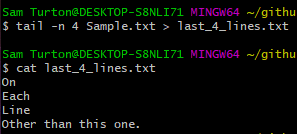

# BASH COMMANDS

## Head, Tail, Sort
#### Head
- Displays the first X lines of a file
- Syntax is `head <options> <file>`
- One option is `head -n<number> <file>` which will get the first <number> of lines

#### Tail
- Tail displays the last X lines of a file
- syntax is `tail <options> <file>`
- One option is `tail -n<number> <file>` which will get the last <number> of lines
- Default for both is 10 lines

#### Sort
- Sort is used to alphabetically or numerically sort the content by each line
- Syntax is ` sort <filename>`
- add command after sort depending what you want to sort by
  - `-r` reverse order
  - `-n` numerical
  - `-nr` numerically reversed
  - `-k <num>n` sort by collumn <num>
  - `-c` check if a file is sorted, if sorted then no output
  - and more

### Demo

## Permissions
- To change file permissions use `chmod` command followed by the permission level and file we would like to edit.
- syntax is `chmod <value> <file>`

| Value   | Meaning    | 
| :-------- | ------: | 
| 777 | No restrictions | 
| 755 | The files owner may read, write and execute. Others may read and execute | 
| 700 | The files owner may read, write and execute. Nobody else has rights | 
| 666 | All users may read and write the file | 
| 644 | The files owner may read and write. Others may only read | 
| 600 | The files owner may read and write. Nobody else has rights \| |

- YOu can also change permissions using flag names
- e.g `chmod +x <file>`
- falgs:
  - +x makes file executable
  - +r gives read rights
  - +w gives write rights

## Streams and Redirect
#### Streams
There are 3 streams in bash. Standard Output, Error and Input stream. These streams are used to recieve and send sequences of characters into and out of bash.
- `stdout` a **standard output stream** which displays output from commands
- `stderr` a **standard error stream** which displays error output from commands
- `strdin` a **standard input stream** which provides inputs to commands

#### Redirects
Redirection is used to send and redirect the output of one command to another command/file etc.
- `n>` this redirects the utput from file n to another file or command
- If the file does not exist it is created
- if it does exist its content is overriden (no warning given)

### Demo

## Wild cards

## Grep

## Streams, piping

## Grep and ps aux, using piping

